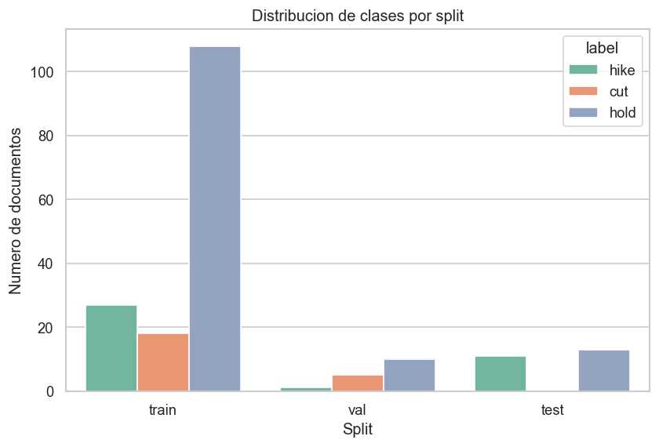
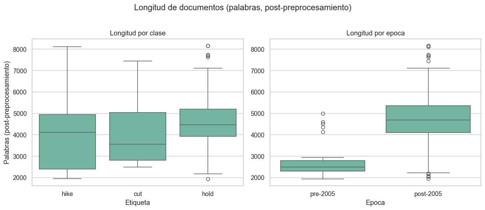
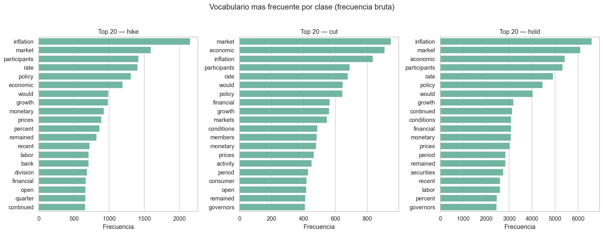
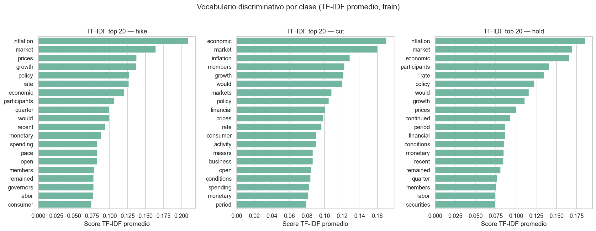
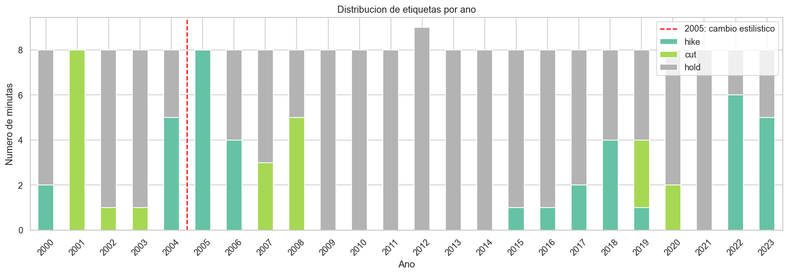
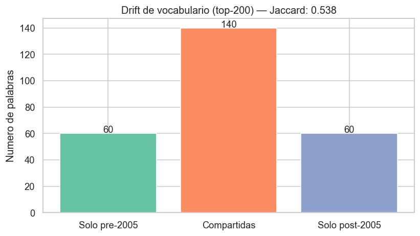
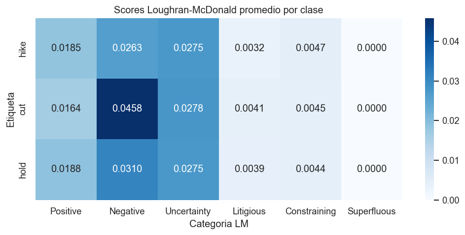
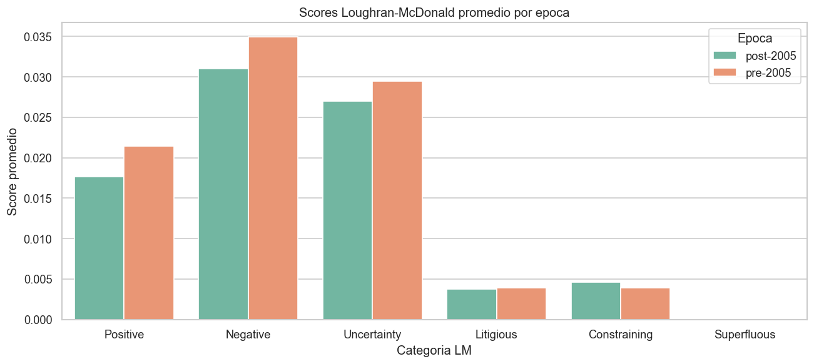

# Análisis Exploratorio del Corpus FOMC

*Segunda entrega — Sección 6: Experimentos*

---

## 1. Dataset final

El pipeline de preprocesamiento produjo un dataset de **193 documentos** correspondientes a minutas del FOMC publicadas entre enero de 2000 y diciembre de 2023. Cada documento está representado por el texto preprocesado de la minuta y la etiqueta de decisión de tasa construida a partir de la serie FRED (`DFEDTAR` hasta 2008, `DFEDTARU` desde 2009).

El split cronológico fijo es el siguiente:

| Split | Período | Documentos |
|:------|:--------|----------:|
| Train | 2000–2018 | 153 |
| Val | 2019–2020 | 16 |
| Test | 2021–2023 | 24 |
| **Total** | | **193** |

La decisión de usar un split cronológico —en lugar de uno aleatorio— se justifica en las secciones 3 y 4: el léxico y la distribución de clases varían significativamente entre épocas, y un split aleatorio produciría contaminación de información entre regímenes monetarios distintos.

---

## 2. Distribución de clases

La Figura 1 y la Tabla 2 muestran la distribución de etiquetas por split.

*Tabla 2. Distribución de clases por split.*

| Clase | Train | Val | Test | Total | % total |
|:------|------:|----:|-----:|------:|--------:|
| hold | 108 | 10 | 13 | 131 | 67,88% |
| hike | 27 | 1 | 11 | 39 | 20,21% |
| cut | 18 | 5 | 0 | 23 | 11,92% |

La clase `hold` domina ampliamente el corpus (67,88%), lo cual refleja los largos períodos de política monetaria estable: la Fed mantuvo la tasa sin cambios durante prácticamente todo 2009–2015 (post-crisis financiera) y durante 2020–2021 (respuesta COVID). Esto tiene una consecuencia metodológica directa: **un clasificador trivial que predice siempre `hold` obtiene una accuracy del 67,88%**. Por esta razón, la métrica principal de evaluación de todos los experimentos será el **F1-macro**, que penaliza el desbalance de clases y exige que el modelo tenga capacidad discriminativa también sobre las clases minoritarias.

Nótese además que en el split de test (`2021–2023`) no hay instancias de `cut`: el período post-pandemia estuvo dominado exclusivamente por decisiones de `hold` y los hikes agresivos de 2022–2023 en respuesta a la inflación. Esto implica que el F1 de la clase `cut` en test dependerá enteramente del recall sobre ejemplos del período 2001 (recesión dot-com) y 2007–2009 (crisis financiera), que sí están presentes en train.

*Figura 1. Distribución de etiquetas por split.*

---

## 3. Longitud de documentos

Tras el preprocesamiento (eliminación de stopwords, puntuación y términos de dominio genérico), se analizó la longitud de los documentos en palabras.

*Tabla 3. Estadísticas de longitud por clase (palabras post-preprocesamiento).*

| Clase | N | Media | Std | Mín | P25 | Mediana | P75 | Máx |
|:------|--:|------:|----:|----:|----:|--------:|----:|----:|
| cut | 23 | 4.012 | 1.428 | 2.485 | 2.806 | 3.564 | 5.041 | 7.453 |
| hike | 39 | 3.844 | 1.532 | 1.946 | 2.392 | 4.111 | 4.946 | 8.119 |
| hold | 131 | 4.452 | 1.391 | 1.934 | 3.923 | 4.473 | 5.205 | 8.173 |

*Tabla 4. Estadísticas de longitud por época (palabras post-preprocesamiento).*

| Época | N | Media | Std | Mín | Mediana | Máx |
|:------|--:|------:|----:|----:|--------:|----:|
| pre-2005 | 40 | 2.725 | 732 | 1.934 | 2.491 | 4.988 |
| post-2005 | 153 | 4.682 | 1.298 | 1.946 | 4.691 | 8.173 |

Dos observaciones son relevantes para el modelado:

**Diferencia por época.** Los documentos post-2005 son en promedio un 72% más largos que los pre-2005 (4.682 vs 2.725 palabras). Esto se debe al cambio de estilo editorial del FOMC a partir de 2005, cuando comenzó a publicar transcripciones con mayor detalle del debate interno. Este drift no solo afecta la distribución léxica (Sección 4), sino también la riqueza del vocabulario disponible para TF-IDF: modelos entrenados sobre un período pueden comportarse de manera diferente al evaluar otro.

**Truncación en FinBERT.** El **100% de los documentos supera las 512 palabras** (límite de tokens de los modelos BERT). Esto implica que el experimento con FinBERT (experimento 4) necesitará una estrategia explícita de truncación o agregación: ya sea truncar al inicio del documento (donde suele estar el resumen de la decisión), aplicar una ventana deslizante con pooling de representaciones, o extraer únicamente el token `[CLS]`.

*Figura 2. Longitud de documentos (palabras) por clase (izquierda) y por época (derecha).*

---

## 4. Vocabulario por clase

Se analizó el vocabulario discriminativo de dos formas complementarias.

**Frecuencia bruta.** Se extrajo el top-20 de palabras más frecuentes por clase, sobre el corpus completo con stopwords y términos de dominio ya eliminados. El análisis revela que las tres clases comparten un núcleo léxico común relacionado con condiciones económicas generales (`economic`, `growth`, `market`, `financial`), lo que sugiere que la frecuencia bruta por sí sola tiene poder discriminativo limitado.

**TF-IDF discriminativo.** Se entrenó un `TfidfVectorizer` sobre el conjunto de entrenamiento y se calculó el score TF-IDF promedio por clase. Este método penaliza palabras ubicuas y resalta las específicas de cada etiqueta. Los resultados muestran diferencias más claras: las minutas de `hike` presentan mayor peso de términos vinculados a inflación y endurecimiento (`inflation`, `tightening`, `elevated`, `restrictive`), mientras que las de `cut` muestran mayor presencia de términos asociados a riesgos a la baja y condiciones acomodaticias. Las minutas de `hold` presentan el vocabulario más neutro y distribuido, consistente con la postura de espera.

La existencia de vocabulario TF-IDF diferenciado entre clases es una condición necesaria (aunque no suficiente) para que el experimento 1 (TF-IDF + regresión logística) pueda capturar señal léxica. El alto solapamiento en frecuencia bruta, en cambio, motiva los experimentos con embeddings (Word2Vec y FinBERT) para capturar similitud semántica.

*Figura 3. Top-20 palabras más frecuentes por clase (frecuencia bruta).*

*Figura 4. Top-20 palabras más discriminativas por clase según score TF-IDF promedio (conjunto train).*

---

## 5. Drift temporal

### 5.1. Drift de etiquetas

La Figura 5 muestra la distribución de etiquetas por año, lo que permite verificar la coherencia del corpus con los ciclos de política monetaria conocidos:

- **2001**: decisiones `cut` (recesión post dot-com y ataques del 11-S).
- **2004–2006**: `hike` sostenido (ciclo de normalización Greenspan/Bernanke).
- **2007–2008**: `cut` agresivos (crisis financiera; la Fed llevó la tasa de 5,25% a 0–0,25% en 14 meses).
- **2009–2015**: `hold` continuo (tasa en el límite cero, política de forward guidance).
- **2015–2018**: `hike` graduales (normalización post-crisis bajo Yellen/Powell).
- **2019–2020**: `cut` (tres recortes preventivos en 2019 + respuesta COVID en 2020).
- **2021**: `hold` (política acomodaticia COVID).
- **2022–2023**: `hike` agresivos (combate a la inflación post-pandemia; ciclo más rápido desde los años 80).

La distribución observada coincide exactamente con los eventos históricos esperados, lo que valida la construcción de etiquetas a partir de la serie FRED.

*Figura 5. Distribución de etiquetas por año (stacked bar). La línea roja punteada marca 2005 (cambio de estilo editorial del FOMC).*

### 5.2. Drift de vocabulario

Se comparó el top-200 de palabras (por frecuencia) del corpus pre-2005 contra el post-2005 usando **similitud de Jaccard**.

| Métrica | Valor |
|:--------|------:|
| Jaccard similarity (top-200) | 0,538 |
| Palabras exclusivas pre-2005 | 60 |
| Palabras compartidas | 140 |
| Palabras exclusivas post-2005 | 60 |

Con un Jaccard de **0,538**, casi el 46% del vocabulario de alta frecuencia no es compartido entre las dos épocas. Ejemplos de palabras exclusivas de cada período:

- **Solo pre-2005**: `action`, `aggregate`, `anecdotal`, `capital`, `confidence`, `chairman` — vocabulario más institucional y descriptivo del funcionamiento de la reunión.
- **Solo post-2005**: `accommodative`, `asset`, `billion`, `appropriate`, `changed` — vocabulario más orientado a la comunicación de la postura de política.

Este resultado tiene una implicación metodológica directa: **un split aleatorio mezclaría documentos de los dos regímenes léxicos**, creando fugas de información entre train y test que inflarían artificialmente las métricas de evaluación. El split cronológico fijo (train 2000–2018, val 2019–2020, test 2021–2023) es la única estrategia que respeta la estructura temporal del corpus y produce una evaluación realista de la capacidad de generalización.

*Figura 6. Tamaño de los conjuntos de vocabulario (top-200) exclusivos a cada época y compartido. Jaccard = 0,538.*

---

## 6. Análisis Loughran-McDonald

Se calcularon scores de tono usando el lexicón Loughran-McDonald (LM), el estándar para análisis de sentimiento en textos financieros. Para cada documento y cada categoría del lexicón, el score se define como la fracción de tokens del documento que pertenecen a ese conjunto. Se utilizaron las categorías disponibles en la versión 2025 del diccionario: `Positive`, `Negative`, `Uncertainty`, `Litigious` y `Constraining` (la categoría `Superfluous` no está disponible en esta versión).

### 6.1. Scores por clase

*Tabla 5. Score LM promedio por clase (fracción de tokens).*

| Clase | Positive | Negative | Uncertainty | Litigious | Constraining |
|:------|--------:|---------:|------------:|----------:|-------------:|
| cut | 0,0164 | **0,0458** | 0,0278 | 0,0041 | 0,0045 |
| hike | 0,0185 | 0,0263 | 0,0275 | 0,0032 | 0,0047 |
| hold | 0,0188 | 0,0310 | 0,0275 | 0,0039 | 0,0044 |

El resultado más destacado es la diferencia en el score `Negative`: las minutas de `cut` presentan un score 74% más alto que las de `hike` (0,0458 vs 0,0263) y 48% más alto que las de `hold`. Esto confirma la hipótesis intuitiva: cuando la Fed baja la tasa, el lenguaje de las minutas refleja condiciones de deterioro, riesgos a la baja y preocupaciones sobre el ciclo económico. En cambio, las minutas de `hike` tienen el menor score de `Negative` de las tres clases, consistente con un contexto de expansión económica que justifica el endurecimiento monetario.

El score `Uncertainty`, en cambio, es prácticamente idéntico entre las tres clases (≈0,0275–0,0278), lo que indica que el lenguaje hedging es una característica estable del género de las minutas FOMC y **no aporta poder discriminativo** para distinguir entre las tres decisiones. Algo similar ocurre con `Litigious` y `Constraining`, cuya variación entre clases es mínima.

La diferencia en `Positive` también es pequeña (0,0164–0,0188) y, paradójicamente, las minutas de `cut` tienen el score `Positive` más bajo, lo que refuerza que en contextos de recorte el tono general es más negativo en ambas polaridades.

### 6.2. Scores por época

*Tabla 6. Score LM promedio por época (fracción de tokens).*

| Época | Positive | Negative | Uncertainty | Litigious | Constraining |
|:------|--------:|---------:|------------:|----------:|-------------:|
| pre-2005 | 0,0214 | 0,0349 | 0,0295 | 0,0039 | 0,0039 |
| post-2005 | 0,0177 | 0,0310 | 0,0270 | 0,0037 | 0,0046 |

Los scores pre-2005 son consistentemente más altos en `Positive`, `Negative` y `Uncertainty`. Esto puede estar relacionado con el cambio de estilo editorial: los documentos pre-2005, aunque más cortos, contienen proporcionalmente más lenguaje de tono marcado. Post-2005, el texto es más extenso pero el vocabulario de tono LM representa una fracción menor del total.

*Figura 7. Heatmap de scores Loughran-McDonald promedio por clase.*

*Figura 8. Scores Loughran-McDonald promedio por época (pre vs post-2005).*

### 6.3. Implicaciones para el experimento 2

El análisis LM muestra que el score `Negative` es el feature más discriminativo para identificar minutas de `cut`. Esto motiva el experimento 2 (LM lexicón + regresión logística): si el modelo logra capturar esta diferencia en `Negative` para separar `cut` de las demás clases, debería mejorar el recall sobre la clase minoritaria respecto al baseline TF-IDF. La debilidad del análisis LM es que `hike` y `hold` tienen scores más similares entre sí, por lo que el lexicón solo difícilmente logre separar esas dos clases con buenos resultados.

---

## 7. Resumen ejecutivo

| Observación | Implicación para el modelado |
|:------------|:-----------------------------|
| `hold` domina (67,88%) | Métrica principal: F1-macro, no accuracy |
| 100% de docs > 512 palabras | FinBERT requiere estrategia de truncación explícita |
| Drift léxico Jaccard 0,538 pre/post-2005 | Split cronológico fijo es obligatorio; split aleatorio introduciría fuga de información |
| Documentos post-2005 son 72% más largos | TF-IDF post-2005 tiene vocabulario más rico; efecto de época potencialmente confusor |
| `Negative` LM: `cut` tiene 74% más que `hike` | Experimento 2 (LM + LR) tiene señal real; `Uncertainty` no discrimina |
| Vocabulario TF-IDF diferenciado entre clases | Experimento 1 (TF-IDF + LR) tiene chances; `hold` puede confundirse con ambas |
| 0 instancias `cut` en test | Recall de `cut` en test depende enteramente de generalización temporal |
